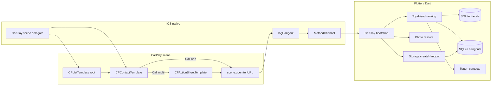

# Friend Builder CarPlay — In-Repo Implementation Plan

**Status:** Design plan (no implementation in this doc’s PR)  
**Product source:** CarPlay research handoff (product decisions locked)  
**Ship path:** iOS TestFlight (Xcode Cloud). Not buildable/testable on the Linux cloud VM.

---

## 1. Goal

Ship a **CarPlay communication app** that shows the **single most overdue/due contactable friend**, lets the driver open a Contact-style detail (name, photo, urgency, Call), dials **cellular `tel:` only**, and **logs a hangout** when dial succeeds (`scene.open` completion `true`).

Non-goals: WidgetKit, multi-friend CarPlay lists, FaceTime/VoIP dialing, Android Auto, messaging as a product feature (compliance surface only — see §2).

---

## 2. Gate: entitlement + communication compliance

### Entitlement

- Target: `com.apple.developer.carplay-communication`
- Request via [Apple CarPlay entitlement form](https://developer.apple.com/contact/carplay) before (or in parallel with) native UI work
- Add to Runner entitlements once approved; wire Debug + Release provisioning profiles that include the entitlement

### Compliance (blocking for App Review)

Apple’s CarPlay Developer Guide requires communication apps to provide **short-form messaging** (SiriKit message intents) **or** **VoIP** (CallKit + `INStartCallIntent`). Friend Builder is neither today.

| Path | Fit with locked product | Plan |
| --- | --- | --- |
| Argue “Phone handoff via `tel:` only” | Matches Call UX | Expect Apple pushback; do not rely on this alone |
| Add VoIP / CallKit | Conflicts with **cellular `tel:` only** | Reject for product |
| **Minimal messaging surface** | Satisfies entitlement rules without changing Call UX | **Chosen compliance strategy** |

**Chosen strategy:** implement the **minimum SiriKit messaging intent suite** Apple requires for communication CarPlay apps (send/search/etc. as specified in the current CarPlay Developer Guide), backed by a deliberately thin, non-primary UI path (e.g. compose/send to a contact via SMS/`INSendMessageIntent` handoff). Messaging is **not** a CarPlay product surface in v1; it exists so the communications entitlement is honest.

**Process gate:** do not submit a CarPlay-enabled build to App Review until (1) entitlement is granted and (2) the messaging intent target is registered and functional enough to pass communication-category review. CarPlay Simulator work can proceed earlier on development-signed builds when the entitlement is present.

---

## 3. Architecture overview

### Why hybrid (native Contact template + Dart logic)

- Locked detail UX maps to Apple’s **`CPContactTemplate` / `CPContact` / `CPContactCallButton`**
- [`flutter_carplay`](https://pub.dev/packages/flutter_carplay) (~1.6.x) does **not** expose the Contact template → do **not** use it as the primary CarPlay UI layer for v1
- Ranking, photo bytes, and hangout writes already live in Dart (`contact_sorting` / `Scheduling`, `ContactPermissionService.getContactPhoto`, `Storage.createHangout`)

**Native owns:** CarPlay scene lifecycle, templates, action sheet, `CPTemplateApplicationScene.open(tel:)`, Call button handlers.  
**Dart owns:** “who is top”, urgency string, photo payload, phone list + labels, hangout create + notification/snooze side effects.

Optional later: thin `flutter_carplay` usage for list-only experiments is unnecessary if native Contact path is already required.

---

## 4. Product → template mapping

| Locked UX | CarPlay surface |
| --- | --- |
| Root: one person + urgency | `CPListTemplate` with a **single** `CPListItem` (title = name, detailText = urgency). Tap → push Contact template |
| Empty: no contactable friends | Same list template with **empty view** title/subtitle (e.g. “No one due” / “Add friends to contact in Friend Builder”). No fake person |
| Detail: name + photo + urgency + Call | `CPContactTemplate` with `CPContact` (name, image, subtitle = urgency) + `CPContactCallButton` |
| Multi-number picker | Call handler presents **`CPActionSheetTemplate`** with one action per labeled number, then `tel:` |
| No phone | Still open detail; subtitle or secondary text **“Missing contact info”**; **omit** Call button (or omit actions entirely). No dial, no hangout |
| Dial | `CPTemplateApplicationScene.open` with `tel:` / `tel://` URL — **not** `UIApplication.shared.open` |
| After dial | If open completion is `true` → Dart logs hangout |

Urgency copy must match phone Friends UI semantics in [`ContactTile`](../lib/pages/friends/components/contact_tile.dart):

- No latest hangout → `"Never seen!"`
- `daysLeft > 0` → `"N days to go"`
- else → `"N days late"` (`abs`)

Photo: same source as [`LazyContactAvatar`](../lib/shared/lazy_contact_avatar.dart) — `ContactPermissionService.getContactPhoto(id)`; if null, native Contact template uses **no image** (or a generated initials image if we choose to rasterize initials in Dart/native). Prefer shipping device photo when present; initials are a phone-UI affordance — on CarPlay, empty image + name is acceptable if initials generation is deferred.

---

## 5. Data payload and ranking reuse

### Payload native needs for one “top person”

- `contactIdentifier`
- Display name
- Photo bytes (nullable)
- Urgency string
- Phones: list of `{ label, dialString }` (digits suitable for `tel:`; strip spaces/punctuation when building URL)
- Flag: `hasPhone`

### Ranking (reuse, do not fork semantics)

Reuse the same ordering as Friends:

1. Load contactable `Friend` rows (`isContactable == true`) via existing storage/DB APIs
2. Join device `Contact` by `Friend.contactIdentifier` (`flutter_contacts`, `withProperties: true` so `phones` are available — **today unused in app code**)
3. Latest hangout per contact id (same idea as Friends page latest-hangout map)
4. Sort with [`sortContactsForDisplay`](../lib/utils/contact_sorting.dart) / [`Scheduling.daysLeft`](../lib/utils/scheduling.dart)
5. Take **first** hangout-contact id only

Extract this into a **shared Dart entry point** callable from CarPlay bootstrap (not from `FriendsPage` UI). Keep calculation identical to Friends so CarPlay and phone never disagree.

### Hangout on successful dial

Mirror simplest Log-tab create defaults:

- `when: DateTime.now()`
- `notes: ''` (or a short stable marker like `"CarPlay call"` only if product later wants analytics; default **empty** to match Log form)
- `isAllDay: false`
- `contacts: [EncodableContact.fromContact(thatContact)]`
- Persist via [`Storage.createHangout`](../lib/storage.dart)
- Then same side effects as Log form: [`clearSnoozeRemindersForContacts`](../lib/utils/notification_helper.dart) (which reschedules next notification)

**Success definition (locked):** `scene.open` completion handler reports success → log hangout. Do **not** wait for call connect/end (Phone owns the call).

**Idempotency:** one hangout per successful open invocation. No hangout if missing phone or user cancels the action sheet.

Cloud sync: follow existing patterns (local write first; weekly/startup sync already in [`CloudSyncService`](../lib/services/cloud_sync_service.dart)). No special CarPlay sync path required for v1.

---

## 6. CarPlay-first launch vs current `main()`

Today [`main()`](../lib/main.dart) initializes cloud sync (async), notifications, debug cleanup, avatar sync, optional background fetch, calendar sync, then `runApp`. CarPlay can connect **before** the phone UI is up.

### Required behavior

1. **CarPlay scene connects early** → native shows either empty-safe template or a short “Loading…” list until Dart can answer
2. Dart engine must be able to answer **getTopPerson** and **logHangout** without requiring the user to open Friends
3. Hangout writes must work against the same SQLite file (`friend-builder.db` via sqflite)

### Approach

- Register CarPlay scene in `Info.plist` / scene manifest independently of Flutter’s first frame
- On Flutter side, register the MethodChannel as early as practical after `WidgetsFlutterBinding.ensureInitialized()` (before or immediately after the existing awaits that touch the DB — debug cleanup already hits sqflite)
- Prefer **not** blocking CarPlay on Firebase/cloud restore; ranking uses local DB + contacts
- If contacts permission is missing: empty root with a message that contacts access is required (same dependency as the phone app)

### Refresh

- Push an updated root/detail when: hangout created from CarPlay; app returns to foreground; friends/hangouts change on phone
- Prefer event-driven refresh (channel invoke after local writes / Friends save) over polling
- After CarPlay hangout log, recompute top person and update root template so the driver sees the next person

---

## 7. iOS project changes (checklist, not implementation)

| Area | Change |
| --- | --- |
| Entitlements | Add `com.apple.developer.carplay-communication` to Runner entitlements (Debug + Release as appropriate) |
| Info.plist | CarPlay / scene configuration: `UIApplicationSceneManifest` with `CPTemplateApplicationSceneSessionRoleApplication` (and phone scene if splitting from FlutterAppDelegate patterns) |
| Scene delegate | New `CPTemplateApplicationSceneDelegate` (or equivalent) owning interface controller, root template, Contact push, action sheet, `open(tel:)` |
| AppDelegate | Scene configuration hooks; ensure Flutter engine / plugin registrant still runs; MethodChannel setup |
| Xcode | Link `CarPlay.framework`; messaging intent extension or in-app SiriKit intents target for compliance (§2) |
| Channels | e.g. `friend_builder/carplay` methods: `getTopPerson`, `logHangout`, optional `subscribeRefresh` |
| flutter_carplay | **Do not** add as primary dependency for v1 Contact UX (gap). Revisit only if Apple templates needed later are covered by the package |
| url_launcher | Not required for CarPlay dial path (native scene `open`). Phone-app dialing remains out of scope unless product expands later |
| Tests | Unit-test ranking/urgency string helpers on Dart side; native CarPlay UI verified on **CarPlay Simulator + device** (not this Linux VM) |

Provisioning, App Store Connect CarPlay capability, and Xcode Cloud signing profiles must include the new entitlement before TestFlight builds with CarPlay will work for external testers.

---

## 8. MethodChannel contract (conceptual)

**`getTopPerson` →**

- `{ found: false }` for empty / no permission, or
- `{ found: true, contactIdentifier, displayName, urgency, photoBase64?, phones: [{label, number}], hasPhone }`

**`logHangout` ←** `{ contactIdentifier }`  

- Resolves contact → `EncodableContact` → `Storage.createHangout` → clear snoozes / reschedule notifications  
- Returns `{ ok: true }` / error

Native never writes SQLite directly; Dart remains source of truth for hangouts and ranking.

---

## 9. Suggested delivery sequence

1. **Compliance + entitlement** — Apple request; scaffold SiriKit messaging intents (gate)
2. **Dart CarPlay service** — shared top-person + urgency + phones + hangout log APIs; unit tests for urgency/ranking selection
3. **Native CarPlay shell** — scene manifest, empty/loading/root list, channel wiring
4. **Contact detail** — `CPContactTemplate`, Call, missing-info, action-sheet multi-number, `tel:` open + hangout
5. **Refresh + lifecycle** — post-hangout root update; foreground refresh; CarPlay-first loading state
6. **Verification** — CarPlay Simulator; device in car or wired CarPlay; TestFlight build with entitlement

---

## 10. Risks and open engineering notes

- **Entitlement denial or messaging requirements heavier than expected** — treat §2 as a hard gate; if Apple requires a fuller messaging app, escalate to product before expanding CarPlay UX
- **Contacts permission / identifier stability** — same risk as phone app; CarPlay empty state must be safe
- **Photo size** — Contact template images should be reasonably sized; downsample in Dart or native if channel payload is large
- **Multiple Flutter engines / headless** — stick to the single app engine + early channel registration unless profiling shows CarPlay-first needs a dedicated engine
- **Linux VM** — analyze/unit-test Dart pieces here; no CarPlay runtime in this environment (see `AGENTS.md`)

---

## 11. Decision summary (plan-level)

| Topic | Decision |
| --- | --- |
| UI layer | Native CarPlay Contact + List + Action sheet |
| flutter_carplay | Not primary for v1 |
| Ranking / hangouts / photos | Dart reuse of existing APIs |
| Dial success | `scene.open` completion `true` → hangout |
| Hangout defaults | `when: now`, one contact, empty notes, not all-day |
| Empty root | Empty list message, no placeholder person |
| Multi-number | `CPActionSheetTemplate` |
| Compliance | Minimal SiriKit messaging surface; not VoIP |
| Entitlement | `com.apple.developer.carplay-communication` |
